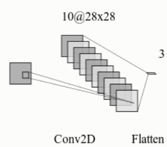
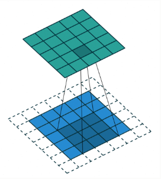
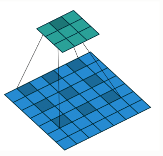
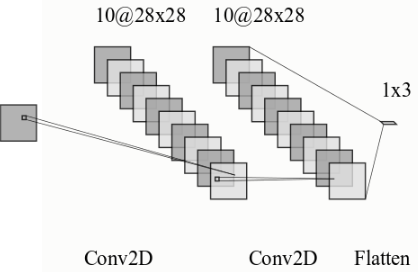

# datacamp-image-processing-with-keras
Repository for all notes and solutions to challenges in the course Image Processing with Keras in Python offered by DataCamp.

# Image Processing with Neural Networks

## Images as data

* Images can be read using the matplotlib library and displayed using a plot function.
* However, the computer does not see the image. It is interpreted as an array/matrix of numbers.
* Colored images are read in 3 dimensions:

        data.shape
        # Prints: (2850, 3000, 3)
    
    Here, the first two dimensions correspond to the heights and width of the image (number of pixels). The third dimension corresponds to the color (RGB). Here, 3 corresponds to Red color.

* A particular pixel can be read by using the spatial dimensions and can be modified.

        data[:10, :10, 0] = 1

    Here, we set the red channel of the first 10x10 pixels to 1, making a red square. The green and blue channels are denoted by 1 and 2 respectively.

## Classifying images

* For example, you have images related to fashion items - Shoes, T-shirts, Dresses. These images can be classified into their respective categories.
* A classifier is trained with the images and their labels.
* While specifying the class labels - Neural networks expect the labels of classes in a dataset to be organized in a one-hot encoded manner: each row in the array contains zeros in all columns, except the column corresponding to a unique label, which is set to 1.
* To evaluate the classifier, images that are not used during training are used.
* The output of the classifier is one-hot encoded. This can be used to find the correct number of predictions.
* Number of correct predictions can be obtained as follows:

        number_correct = (test_labels * predictions).sum()


# Using Convolutions

In the above section, we just used pixels in the images for classification.
However, natural images often contain correlations, such as, some pixels may represent edges or a contour. Such correlations are of great use in classification.

## Convolutions

* Each image can be assumed to be made up of pixels that represent one mathematical operation called Convolution. This is a basic operation that is used by Convolutional Neural Networks to process images.

### Convolution Example

Consider the following data:

        array = np.array([0,0,0,0,0,1,1,1,1,1])

    Here, the above data represents an edge where the values go from 0 to 1.

* A kernel represents the feature we are looking for:

        kernel = [-1, 1]

* A convolution of an one-dimensional array with a kernel comprises of taking the kernel, sliding it along the array, multiplying it with the items in the array that overlap with the kernel in that location and summing this product.

* Similarly, a convolution in two dimensions can be created. Here, the kernel and the window of the image pixels is a 2D matrix.

* Examples:

    A kernel that identifies vertical lines in an image:
    ```
    [-1, 1, -1
     -1, 1, -1
     -1, 1, -1]
    ```

    A kernel that identifies horizontal lines in an image:
    ```
    [-1, -1, -1
      1,  1,  1
     -1, -1, -1]
    ```

    A kernel that identifies a bright spot surrounded by dark spots:
     ```
    [-1, -1, -1
     -1,  1, -1
     -1, -1, -1]
    ```

## Convolutions in Keras

Keras provides functions to create convolutional neural networks.

    from keras.models import Sequential
    from keras.layers import Conv2D, Dense, Flatten
    
    model = Sequential()
    model.add(Conv2D(10, kernel_size=3, activation='relu', input_shape=(img_rows, img_cols, 1)))
    model.add(Flatten())
    model.add(Dense(3, activation='softmax'))

Here, the Flatten layer is a connector between the convolutional layer and the Dense layer. It takes the output of the convolutional layer which is in the form of a feature map and flattens it into a one dimensional array.



### Tweaking Convolutions

1. Padding

* In cases as above, the output has less dimensions as compared to the input. To avoid this, the input can be zero padded.
* Padding allows a convolutional layer to retain the resolution of the input into this layer.
* This is done by adding zeros around the edges of the input image, so that the convolution kernel can overlap with the pixels on the edge of the image.



* In keras, this can be done by adding a 'padding' keyword argument to the keras Conv2D function.

    Conv2D(10, kernel_size=3, activation='relu', input_shape=(img_rows, img_cols, 1), padding='same')

The default behavior is no padding applied and can be specified by padding='valid'.

2. Size of the Stride

* The size of the strides of the convolution kernel determines whether the kernel will skip over some of the pixels as it slides along the image.
* This affects the size of the output because when strides are larger than one, the kernel will be centered on only some of the pixels.
* For example, although padding is applied, the size of the output can be smaller than the input if the step size is 2 pixels.
* Stride can be specified using the *strides* keyword argument to Conv2D. The default value is 1.

3. Dilated Convolutions

You can also control which pixels get affected by the kernel. Such convolutions are called *Dilated Convolutions*.

In keras, this can be achieved by passing a parameter *dilation_rate* to the Conv2D method.



### Calculating the size of the output

The size of the output can be calculated with the help of a simple formula:

    O = ((I - K + 2P) / S) + 1

    where,
    I = Size of the Input
    K = Size of the Kernel
    P = Size of the zero padding
    S = Strides

# Building Deeper CNNs

* Multiple convolutional layers can be added to build deeper CNNs.



* Deeper CNNs are needed to gradually build up representation of objects in the images.
* The first layers can capture features such as oriented lined, the last few layers can capture complex objects based on the outputs of these layers. Hence, deeper networks are more useful in image processing.


